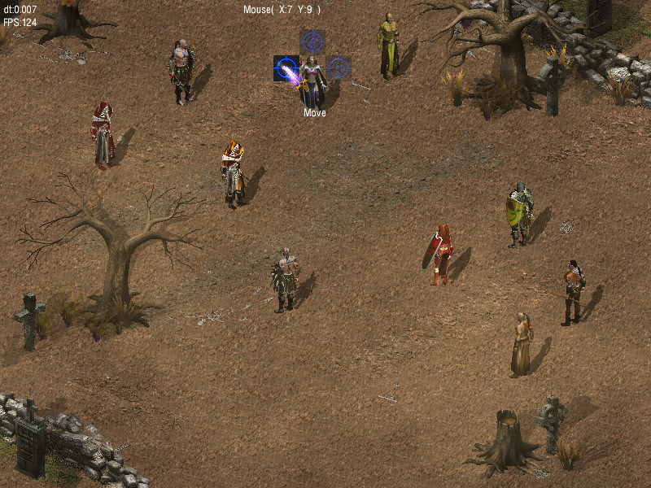

# RF-2D-Engine-Cpp

Principal Adversaries was a turn based strategy game with a fantasy setting. This game was about 80% done when I lost access to the art library. Finding readymade and available replacement artwork proved to be impossible. In the end I just abandoned the idea.

From a programming standpoint I think there are a few fairly nice things here.
* GUI - I never finished my plan to make a GUI that loaded from XML. So this one still has to be built in code, BUT it is broken up into controls like buttons, textboxes, labels, etc. Each with event and customizable properties. So it is rather easy to assemble a GUI.
* Lua Scripts - All of the AI, Spells, maps, etc. are controlled by Lua scripts. 
* Effects - The game has several environmental effects like shadows, fog, clouds, snow, ect. that are not that easy to pull off in a 2D environment. 
* A good examples of: an isometric version of A-Star, a Game State manager and a working game and lobby server

## Game Development Tool Set
The tool set I made for actually building the game is also here on GitHub
[Tools](https://github.com/RandomFeatures/RF-2D-Engine-ToolSet) 

## 3rd party libraries used in the game
* [Raknet](http://www.jenkinssoftware.com/) - The multiplayer network library
* [HGE](http://kvakvs.github.io/hge/) - The DirectX rendering library 
* [LuaBind](https://github.com/luabind/luabind) - The Lua scripting library

## Screenshots

